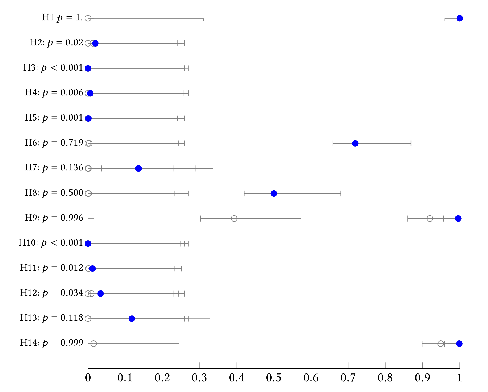

# Results of our Survey on Human Assessment of the Influence of Structural Features on Comment Relevance

This repository contains the anonymized survey results we have collected for our research on the structural aspects of 
comment relevance.  

The survey has been conducted with workers from Amazon Mechanical Turk (MTurk) from the US. Most questions has different scenarios which were randomly assigned to a participant during the survey. The results file only contains the answers of participants who answered at least 4 of 6 control questions correctly.

The file `Evaluation.ipynb` in the folder `evaluation` contains the evaluation of our survey. The file is a Jupyter 
Notebook and can be easily rerun to verify our results. We also provide a HTML export for the Jupyter Notebook in case you have any issues with displaying the notebook. 

All questions that have been asked can be found in `codebook_project.csv`
in the folder `evaluation/SurveyResults` while all anonymized survey results can be found in `survey_results.csv` in the
same folder.

## Results
 

Here, we see the Clopper-Pearson confidence intervals for expected answer of the three questions for each hypothesis for H0 ``expected answer is not the most frequent answer``. The blue dot highlights the p-value for the complete hypothesis.

## Demographic Information
We consider here only participants who answered at least 4 of 6 control questions correctly.

| Age Group | #   |
|-----------|-----|
| < 20      | 0   |
| 20-29     | 10  |
| 30-39     | 19  |
| 40-49     | 3   |
| 50-59     | 3   |
| 60-69     | 1   |

| Gender        | #   |
|---------------|-----|
| Male          | 15  |
| Female        | 21  |
| Diverse       | 0   |
| Different     | 0   |
| Not Specified | 0   |

| Education       | #   |
|-----------------|-----|
| No Degree       | 0   |
| High-School     | 7   |
| College Degree  | 10  |
| Graduate Degree | 19  |
| Not Specified   | 0   |

